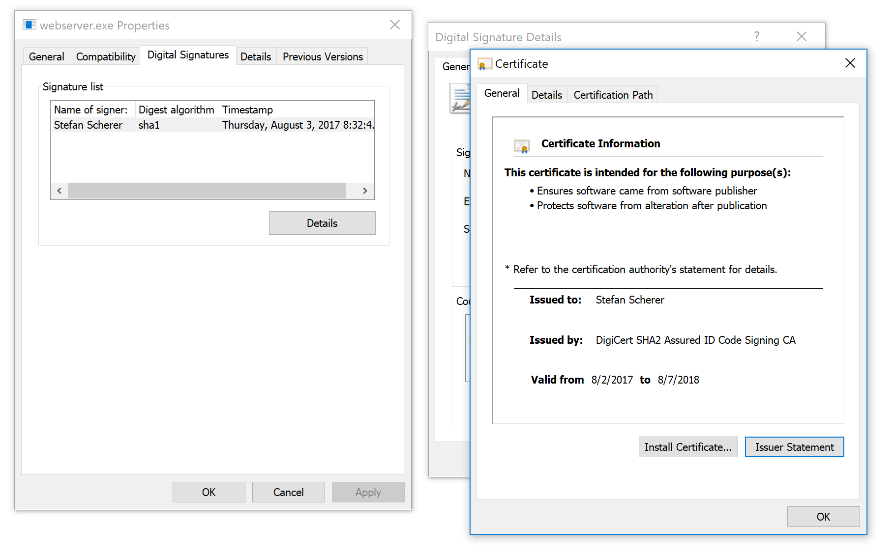

# signtool

This is a small bash helper script so I can code sign a Windows exe/dll/ps1 file
from my Mac with the help of a Windows container.

The Windows container runs a small PowerShell script that uses [`Set-AuthenticodeSignature`](https://docs.microsoft.com/de-de/powershell/module/Microsoft.PowerShell.Security/Set-AuthenticodeSignature?view=powershell-5.1).

The cert has a password and is stored on my Mac.
The password itself is encrypted in my pass password store.

Usage:

```
$ ./signtool webserver.exe


    Directory: C:\signing


SignerCertificate                         Status             Path              
-----------------                         ------             ----              
4......................................F  Valid              webserver.exe     
```

On Windows you can check the digital signature in the fiel properties:


