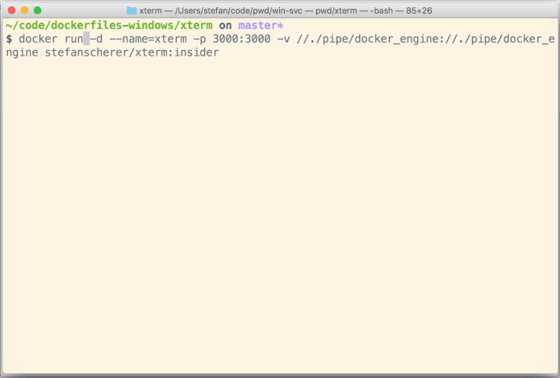

# xterm

Run xterm.js demo in a Windows container

## classic windowsservercore image

```
docker run -d -p 3000:3000 stefanscherer/xterm:windows
```

Open a browser.

## Insider

Map the Docker named pipe into the Windows container to play with the Docker CLI inside the xterm in your browser.

```
docker run -d -p 3000:3000 -v //./pipe/docker_engine://./pipe/docker_engine stefanscherer/xterm:insider
```

Open a browser. Then play with Docker :-)



